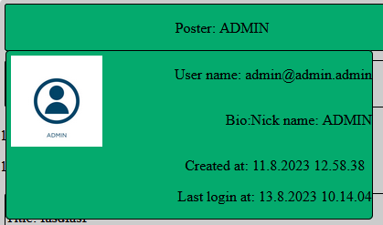
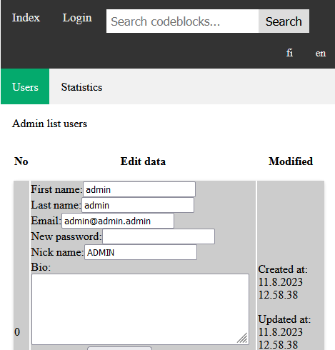
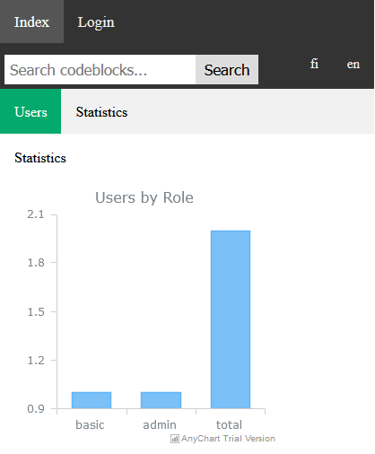

## Project description

[See here](https://docs.google.com/document/d/1zSfVZcnv7FUnu6VxwKLXBPZHqTIdRX1w3d9Yer_mKVU/edit)

## Scoring table

| Property | Points | Done |
| -- | -- | :--: |
| Basic properties | 25 | |
| Google/Facebook/Twitter login | 2 | |
| Use of highlight library | 2 | x |
| Use of pager (> 10 posts) | 2 | |
| Edit their own comments/posts | 4 | x |
| Voting posts and comments (one per user) | 3 | x |
| Search in order to filter messages | 2 | x |
| User profiles have images next to posts/comments | 3 | x |
| Username is clickable and shows a profile page with name, register date (picture) and user bio | 2 | x |
| Last edited timestamp is stored and shown with posts/comments | 2 | x |
| Translation (> 2 languages) | 2 | x |
| Admin account capable of edit all posts and delete ALL contents incl comments | 3 | x |
| Unit tests | 5 | |
| Accessibility testing/reporting | 3 | | 
| Statistics: <em>AnyChart</em>  | 2-4 | x |
| Template engine: <em>PUG</em> | ? | x |

Total amount of points to be achieved is 65, the goal for the project is min 50.

## Documentation

See below and 
[here](./documentation/)

## Instructions 

<h3>Intialization</h3>

Install with <em>NPM</em> `npm install` and run `npm start`. The program will run at port <em>3000</em> and at MongoDB address <em>mongodb://localhost:27017/projektidb1</em>

When the app is started user roles are created (if they don't exist) at `app.js`. The role generation is done by using the route <em>/admin/add_role</em> and this is of course unsafe option for IRL use. First ever user to register will receive <em>admin</em> rights. In addition, each time the app is started and old login tokens are deleted.

Default port <em>3000</em> and db url <em></em> can be easily changed at `app.js`. JWT token expiration time is set to 20 minutes and can be adjusted at `/routes/api.js`.

<h3> Viewing codes and comments </h3>
All codes and comments can be seen in the landing page (the first view, root at '/'). The code poster's information can be seen by hovering on top of top row or green part of the codeblock. If user is logged in then the hover also shows the poster's emails and bios. Vote counts either up or down are also shown in both code and comment blocks.

<h3>Registering users</h3>
When staring the program register from the register menu. User input is checked for correctness. For example, password length should be more than 8 characters, only alphanumerics should be used and at least one capital and lowercase letter should be used. As the email is to be used as username it should be unique and of course contain the @ sign.

<h3>Permissions</h3>
Two basic user roles are applied <em>admin</em> and <em>basic</em>. When the user logs in as admin then an <em>admin</em> menu will appear containing the capabilities of 
- editing user info and removing them
- in landing page admin is capable of deleting any code and comment
- viewing database statistics

For the users the following features are available from their respective menu:
- editing their information (except delete)
- adding new codes
- viewing their own codes


<h3>Login and logout</h3>
User is identified based on their unique <em>email</em> and <em>password</em>. Once user logs in a token is created in lthat expires in <em>20 minutes</em>. 

User can logout by pressing <em>logout</em> button from the top navbar. 

<h3>Localization</h3>
Users can switch between English and Finnish language versions from top navbar designated by <em>en</em> and <em>fi</em>, respectfully.

<h3>Adding code blocks</h3>
Logged in users can add new code from <em>user->add codeblock</em>


<h3>Editing user information</h3>
Logged in user can edit their information inputted during register from <em>user->add codeblock</em>. Only <em>admin</em> can delete a user, however.

If an admin deletes a user all related codes, comments and votes are deleted in addition to the user profile.

<h3>Adding comments to code blocks</h3>
Once a code has been added by a user it is possible for logged in users to add comments to existing codeblocks by clicking <em>add comment</em>, addint a title, the comment and submitting it.

<h3>Editing codes and comments</h3>
Logged in users may edit their own codes and comments by changing the textview show below their own code and pressing <em>Save</em>.

Code or comment can be deleted by pressing <em>Delete code</em> or <em>Delete comment</em>, respectfully. The former deletes all related comments and votes, the latter only the votes.

<h3>Voting codes and comments</h3>
Logged in users can vote each other's (but not their own) codes or comments. Only single vote per code or comment is allowed and it's not possible.

<h3>Searching codes</h3>
In order to search the comments the top right corner search bar may be used. Searching does not require login.

<h3> Responsiveness</h3>
The searchbar in the top navbar will move below the links at 700px width. Sidebar menus at user and admin views will collapse into a navbar also at this width. Finally, the charts at <em>admin->statistics</em> will move from a grid layout to a single column.

# Database 
 

# UI


## Register

|  |  |
| -- | -- |
| Form | 

## Login 

|  |  |  |
| -- | -- | -- |
| Form |  |  |
| Form errors |  |  |

## User

|  |  |  |
| -- | -- | -- |
| Card |  | |
| admin edit user| 
| admin statistics, en | 
| user add code | 


# Dependencies
```
"dependencies": {
    "bcrypt": "^5.1.0",
    "bcryptjs": "^2.4.3",
    "cookie-parser": "^1.4.6",
    "cors": "^2.8.5",
    "debug": "^4.3.4",
    "dotenv": "^16.3.1",
    "express": "^4.18.2",
    "express-session": "^1.17.3",
    "express-validator": "^7.0.1",
    "highlight.js": "^11.8.0",
    "http-errors": "^2.0.0",
    "i18next": "^23.4.2",
    "i18next-browser-languagedetector": "^7.1.0",
    "i18next-http-backend": "^2.2.1",
    "i18next-http-middleware": "^3.3.2",
    "jsonwebtoken": "^9.0.1",
    "mongoose": "^7.4.1",
    "morgan": "^1.10.0",
    "multer": "^1.4.5-lts.1",
    "node-fetch": "^2.6.12",
    "nodemon": "^3.0.1",
    "pug": "^3.0.2"
  }
```